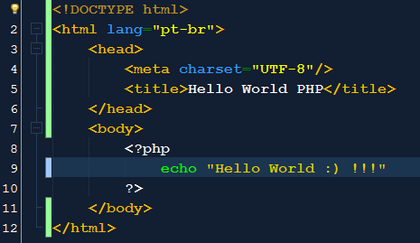

# hello-world
    <p align="center">
        <a>
             
        </a>
    </p>
## A origem
Quem já é programador(a) já utilizou este termo lá no início de seu aprendizado, mas será que sabe a origem do mesmo?
A moda de usar o “Hello World” (Olá Mundo) foi criada por Brian Kernighan em 1972, que escreveu um código em C no seu livro
“A Linguagem de Programação C” (The C Programming Language) no 1 capítulo e o código contido era o seguinte:

``` bash
        int main()
        {
            printf("Hello world!\n");
            return 0;
        }

```

Segundo Brian Kernighan essa foi a melhor e mais simples maneira de ensinar a instrução printf,
que é utilizada para exibir uma mensagem na tela. 
Desde então o termo foi popularizado e muito utilizado por vários professores para ensinar diversas
linguagem de programação.
O “Hello World” é bastante utilizado para iniciar programas, muitos dizem que se você começar aprender
uma linguagem de programação e não fazer aparecer na tela este termo, você nunca irá aprender está linguagem.
